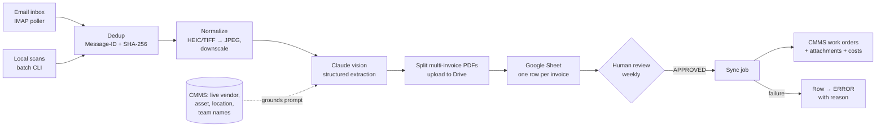

# Invoice → Maintenance Record Pipeline

**A vision-LLM pipeline that turns messy maintenance invoices (scanned paper, phone photos, multi-invoice PDFs, handwriting) into structured, human-reviewed work orders in a CMMS.**

> **Case study.** This was built during my AI Engineer internship at a manufacturing company and runs in production there. The original code is proprietary, so this repo documents the problem, architecture, and design decisions. A public reimplementation with synthetic invoices and a mock CMMS API is in progress.

---

## The problem

The plant's maintenance history lived on paper. Vendor invoices showed up by email, as phone photos, or as stacks of scanned pages, often handwritten, and someone had to retype each one into the maintenance system (MaintainX). Two things made this harder than ordinary OCR:

1. **The output has to match real records.** A work order is only useful if it links to the *actual* asset, vendor, location, and technician already in the system. "Line 2 extruder" has to resolve to a specific asset ID, not free text.
2. **Mistakes have to be caught before they reach the system of record.** A wrong cost or a duplicated work order pollutes maintenance history that technicians rely on.

## What it does

- A **long-running monitor** polls a dedicated inbox and processes each attachment. A **batch CLI** handles the paper backlog from local folders.
- **Claude's vision model** extracts each invoice into a strict JSON schema (vendor, date, assets, description, total, assignee, page range).
- Each invoice becomes a **row in a Google Sheet**, which acts as the review queue. A person checks rows weekly and marks them `APPROVED`.
- A **sync job** (run automatically on an interval, or manually with `--dry-run`) creates completed work orders in the CMMS with the invoice attached and the cost recorded.
- A sibling entry point handles **handwritten service-log binders**, where each page holds many dated one-line entries for a single production line, using the same normalize, dedup, and sheet infrastructure.

## Design decisions

### A human-in-the-loop by design
The LLM never writes to the system of record directly. The spreadsheet is a cheap, familiar review interface for a non-technical maintenance team, and it creates a clear approval checkpoint. Extraction is automated, and commitment is human.

### Extraction grounded in live system data
Before each extraction, the pipeline pulls the real vendor, asset, location, category, and team names from the CMMS API and puts them in the prompt, instructing the model to return matches **verbatim**. At sync time, names resolve back to IDs with exact match first, then fuzzy match (difflib ≥ 0.85). Names that don't match are **kept as text and flagged**, never silently dropped. This turned "free-text guessing" into "pick from a known list," which is a much easier task for the model and much easier to verify.

### Schema-constrained output instead of repair logic
Extraction uses structured outputs (a JSON schema enforced by the API), so responses are always parseable. There is no retry-and-repair layer because there is nothing to repair. Requests are **streamed with a high token cap** because multi-invoice batch scans, plus model reasoning, overflow non-streaming output limits. Refusals and truncation raise explicit errors, and the monitor catches errors per attachment so one bad file never stops the service.

### Two-layer deduplication
- **Email Message-ID:** a re-delivered email is skipped entirely.
- **File SHA-256:** the same bytes are never extracted twice, whether they arrived by email or batch upload.

Both are stored in a small SQLite state file. This keeps API cost down and prevents duplicate rows. It also means the monitor must run on exactly one machine, which is documented as a deployment constraint.

### Idempotent, resumable sync
The sync writes the new work-order ID back to the sheet **immediately after creation**, before attachments, costs, or status changes. If anything fails partway, a re-run sees the ID, skips creation, and resumes the remaining steps (skipping the cost entry so it's never doubled). Because sync runs on a timer, a failing row is flipped to `ERROR` with a reason rather than retried forever. The human fixes it and sets it back to `APPROVED`.

### Fitting messy reality to a strict API
- **Multi-invoice PDFs:** the model returns a page range per invoice, and the pipeline splits the PDF so each work order gets only its own pages.
- **One invoice, several machines:** the CMMS accepts only one asset per work order, so the pipeline writes one row per machine. Only the first row carries the total, so costs aren't double-counted.
- **Asset/location conflicts:** when an asset resolves, its own location overrides the extracted one, since the API rejects mismatches. Any override is noted on the row.
- **Attachment visibility:** the CMMS only shows images in a work order's photo strip, so PDFs are attached twice: as the original and as rendered page images.

## Tech stack

Python · Anthropic API (vision, structured outputs, streaming) · IMAP/SMTP · Google Sheets API (service account) · Google Drive API (OAuth) · MaintainX REST API · SQLite · pypdf / PyMuPDF · Pillow

## Results

- Replaced manual retyping of maintenance invoices with a review-and-approve workflow.
- Handles handwritten invoices, phone photos, multi-invoice scans, and handwritten service binders.
- Deployed on a Windows floor computer with an auto-restarting launcher, running unattended.

<!-- TODO: add measured numbers if you have them, e.g. invoices processed, review time per invoice, % of rows approved without edits. -->

## What I'd do next

- **Measure extraction accuracy** against a labeled set (field-level accuracy, split by printed vs. handwritten).
- **Confidence scores per field** so reviewers can focus on the uncertain ones.
- **Move dedup state off the machine** (e.g., into the sheet or a small hosted DB) so the monitor isn't tied to one computer.

## Screenshots

<!-- TODO: add redacted screenshots: a sample (synthetic) invoice, the review sheet, and a created work order. -->
